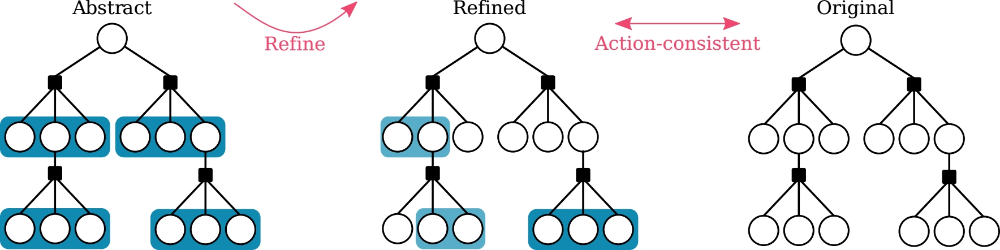

# Adaptive-Information-BSP
An accompanying repository for "Adaptive Information Belief Space Planning", to
be published in IJCAI 2022. Check out the
[arxiv version](https://arxiv.org/abs/2201.05673).

 

AI-BSP is an online, general purpose POMDP solver with both state-dependent and
entropy as reward functions. It uses an adaptive approach to increase
computational efficiency at run time; for more details please see the [paper](https://arxiv.org/abs/2201.05673). For the mathematical proofs and derivations see the attached [appendices](https://github.com/moranbar/Adaptive-Information-BSP/blob/main/Adaptive%20Information%20Belief%20Space%20Planning%20Supplementary.pdf) file.

To run the code, simply clone the repository to your local machine and run
main.jl.


## Citing
If you found AI-BSP useful in your research, feel free to cite us!
```
@article{barenboim2022adaptive,
  title={Adaptive Information Belief Space Planning},
  author={Barenboim, Moran and Indelman, Vadim},
  journal={arXiv preprint arXiv:2201.05673},
  year={2022}
}
```
